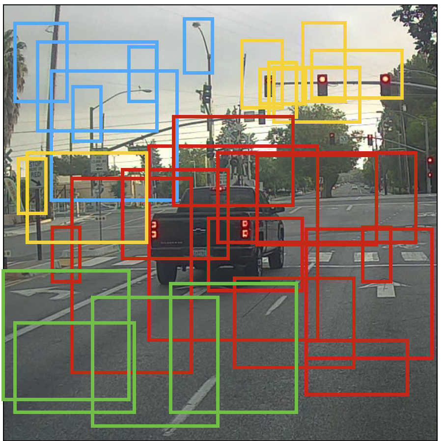

# Autonomous Driving - Car Detection

Welcome to the Week 3 programming assignment! In this notebook, you'll implement object detection using the very powerful YOLO model. Many of the ideas in this notebook are described in the two YOLO papers: [Redmon et al., 2016](https://arxiv.org/abs/1506.02640) and [Redmon and Farhadi, 2016](https://arxiv.org/abs/1612.08242). 

**By the end of this assignment, you'll be able to**:

- Detect objects in a car detection dataset
- Implement non-max suppression to increase accuracy
- Implement intersection over union
- Handle bounding boxes, a type of image annotation popular in deep learning

## 1 - Problem Statement

You are working on a self-driving car. Go you! As a critical component of this project, you'd like to first build a car detection system. To collect data, you've mounted a camera to the hood (meaning the front) of the car, which takes pictures of the road ahead every few seconds as you drive around. 

<video width="400" height="200" src="nb_images/road_video_compressed2.mp4" type="video/mp4" controls>
</video>

<caption>
 Pictures taken from a car-mounted camera while driving around Silicon Valley.   Dataset provided by <a href="https://www.drive.ai/">drive.ai</a>.

</caption>

You've gathered all these images into a folder and labelled them by drawing bounding boxes around every car you found. Here's an example of what your bounding boxes look like:

<caption>
 <u><b>Figure 1</u></b>: Definition of a box  
</caption>

If there are 80 classes you want the object detector to recognize, you can represent the class label $c$ either as an integer from 1 to 80, or as an 80-dimensional vector (with 80 numbers) one component of which is 1, and the rest of which are 0. The video lectures used the latter representation; in this notebook, you'll use both representations, depending on which is more convenient for a particular step.  

"You Only Look Once" (YOLO) is a popular algorithm because it achieves high accuracy while also being able to run in real time. This algorithm "only looks once" at the image in the sense that it requires only one forward propagation pass through the network to make predictions. After non-max suppression, it then outputs recognized objects together with the bounding boxes.

### 2.1 - Model Details

#### Inputs and outputs
- The **input** is a batch of images, and each image has the shape (608, 608, 3)
- The **output** is a list of bounding boxes along with the recognized classes. Each bounding box is represented by 6 numbers $(p_c, b_x, b_y, b_h, b_w, c)$ as explained above. If you expand $c$ into an 80-dimensional vector, each bounding box is then represented by 85 numbers. 

#### Anchor Boxes
* Anchor boxes are chosen by exploring the training data to choose reasonable height/width ratios that represent the different classes.  For this assignment, 5 anchor boxes were chosen for you (to cover the 80 classes), and stored in the file './model_data/yolo_anchors.txt'
* The dimension of the encoding tensor of the second to last dimension based on the anchor boxes is $(m, n_H,n_W,anchors,classes)$.
* The YOLO architecture is: IMAGE (m, 608, 608, 3) -> DEEP CNN -> ENCODING (m, 19, 19, 5, 85).  

#### Encoding
Let's look in greater detail at what this encoding represents. 

<caption>
 <u><b> Figure 2 </u></b>: Encoding architecture for YOLO  
</caption>

#### Visualizing bounding boxes
Another way to visualize YOLO's output is to plot the bounding boxes that it outputs. Doing that results in a visualization like this:  

<caption>
 <u><b>Figure 6</u></b>: Each cell gives you 5 boxes. In total, the model predicts: 19x19x5 = 1805 boxes just by looking once at the image (one forward pass through the network)! Different colors denote different classes.   
</caption>

#### Non-Max suppression
In the figure above, the only boxes plotted are ones for which the model had assigned a high probability, but this is still too many boxes. You'd like to reduce the algorithm's output to a much smaller number of detected objects.  

To do so, you'll use **non-max suppression**. Specifically, you'll carry out these steps: 
- Get rid of boxes with a low score. Meaning, the box is not very confident about detecting a class, either due to the low probability of any object, or low probability of this particular class.
- Select only one box when several boxes overlap with each other and detect the same object.

**Expected Output**:

<table>
    <tr>
        <td>
            <b>scores[2]</b>
        </td>
        <td>
           9.270486
        </td>
    </tr>
    <tr>
        <td>
            <b>boxes[2]</b>
        </td>
        <td>
           [ 4.6399336  3.2303846  4.431282  -2.202031 ]
        </td>
    </tr>
    <tr>
        <td>
            <b>classes[2]</b>
        </td>
        <td>
           8
        </td>
    </tr>
        <tr>
        <td>
            <b>scores.shape</b>
        </td>
        <td>
           (1789,)
        </td>
    </tr>
    <tr>
        <td>
            <b>boxes.shape</b>
        </td>
        <td>
           (1789, 4)
        </td>
    </tr>
    <tr>
        <td>
            <b>classes.shape</b>
        </td>
        <td>
           (1789,)
        </td>
    </tr>

</table>